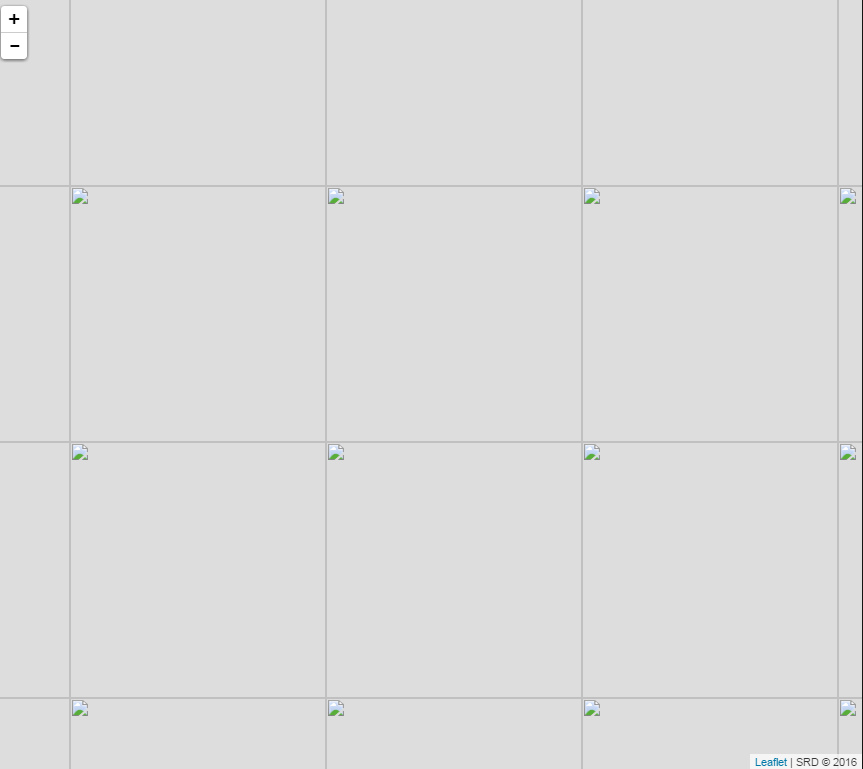

<h1>Proj4js - non mercator projection</h1>
<h3>-- close, oh so close --</h3>

but still fishy - not right

WMS source: <a href="http://tiles.arcgis.com/tiles/Uj11SaUIGBo5JYFY/arcgis/rest/services/Sayward_Basemap/MapServer" target="_blank"> http://tiles.arcgis.com/tiles/Uj11SaUIGBo5JYFY/arcgis/rest/services/Sayward_Basemap/MapServer</a>

I get this   when I use <a href="Tst.html" target="_blank">this</a>
